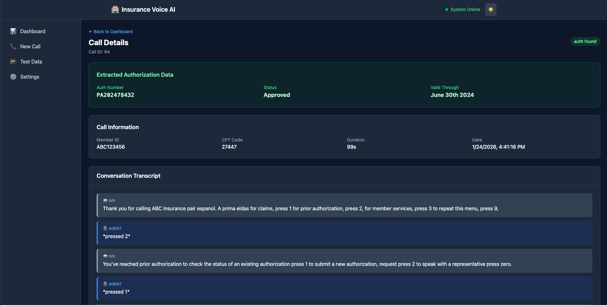
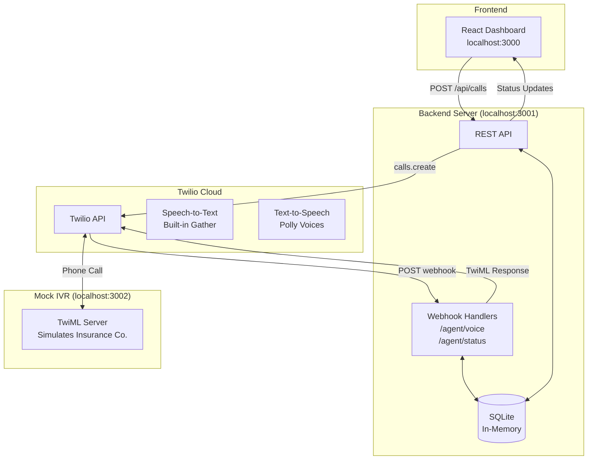
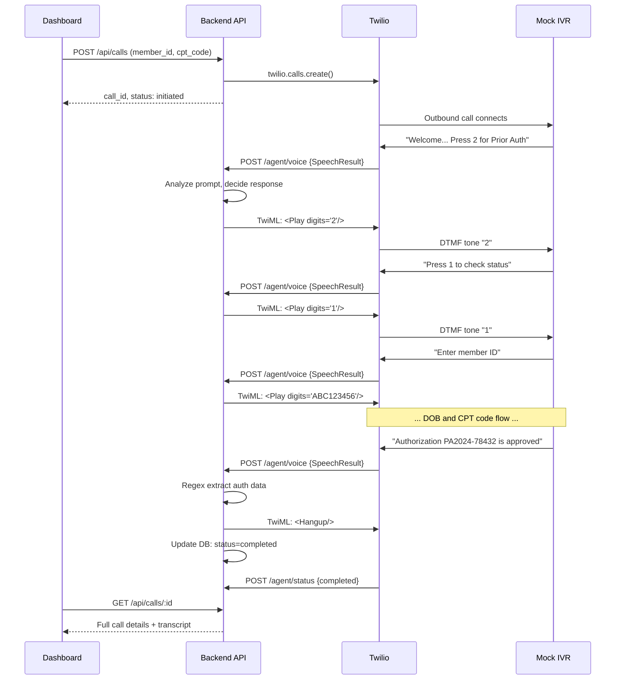

# Insurance Prior Auth Voice AI Agent POC

A proof-of-concept demonstrating an AI voice agent that autonomously calls insurance company IVR systems to check prior authorization status.

## What This Does

This POC automates the tedious process of calling insurance companies:

1. Dials an insurance IVR phone number via Twilio
2. Navigates the phone tree using DTMF tones
3. Provides member information (ID, DOB, CPT code) when prompted
4. Extracts structured authorization data from the response

**Target audience:** Healthcare technology companies looking to automate patient access workflows.

## Screenshot




## Architecture

### System Overview



### Call Flow Sequence



### How It Works (Webhook-Driven)

The agent doesn't stream audio continuously. Instead, it's **webhook-driven**:

1. Backend initiates outbound call via Twilio SDK
2. Twilio connects to the target phone number (Mock IVR)
3. When the IVR speaks, Twilio's built-in speech recognition captures it
4. Twilio sends a webhook to `/agent/voice` with the transcribed speech
5. Backend analyzes the prompt, decides the response (DTMF tones or info)
6. Backend returns TwiML (Twilio's XML format) with instructions
7. Twilio executes the TwiML and repeats

This keeps the backend stateless per-request—session state is stored in-memory keyed by Twilio's CallSid.

### Current Implementation vs Future Enhancements

| Function | Current (POC) | Future (Production) |
|----------|---------------|---------------------|
| Speech-to-Text | Twilio's built-in `<Gather>` | Deepgram (better accuracy) |
| Text-to-Speech | Twilio Polly voices | ElevenLabs (natural voices) |
| Data Extraction | Regex pattern matching | Claude API (robust NLP) |
| Voice Pipeline | Webhook-driven | Pipecat (real-time streaming) |

The POC uses Twilio's simpler built-in services intentionally—fewer moving parts for proving the concept. The Python agent with Pipecat/Deepgram/ElevenLabs/Claude is scaffolded in `/agent` for future implementation.

## Components

| Component | Technology | Port | Description |
|-----------|------------|------|-------------|
| **Dashboard** | React + Vite + Tailwind | 3000 | Web UI for initiating calls and viewing results |
| **Backend** | Express + SQLite (sql.js) | 3001 | API server, webhooks, and in-memory database |
| **Mock IVR** | Express + TwiML | 3002 | Simulated insurance phone system for testing |

## Quick Start

### Prerequisites

- Node.js 18+
- A Twilio account with two phone numbers (see [Twilio Setup Guide](docs/TWILIO-SETUP.md))
- ngrok (for exposing local webhooks to Twilio)

### 1. Clone and Install

```bash
git clone <repo-url>
cd voice-agent-poc-v2

# Install all dependencies
./init.sh

# Or manually:
cd backend && npm install && cd ..
cd dashboard && npm install && cd ..
cd mock-ivr && npm install && cd ..
```

### 2. Configure Environment

```bash
cp .env.example .env
```

Edit `.env` with your Twilio credentials:

```bash
# Required for real calls
TWILIO_ACCOUNT_SID=your_account_sid
TWILIO_AUTH_TOKEN=your_auth_token
TWILIO_PHONE_NUMBER=+1234567890  # Your Twilio number

# Set after starting ngrok (see step 4)
AGENT_WEBHOOK_URL=https://your-ngrok-url.ngrok.io
IVR_PHONE_NUMBER=+1987654321  # Target to call (use second Twilio number for testing)
```

### 3. Start the Servers

In three separate terminals:

```bash
# Terminal 1: Backend API
cd backend && npm run dev

# Terminal 2: Dashboard
cd dashboard && npm run dev

# Terminal 3: Mock IVR
cd mock-ivr && npm run dev
```

### 4. Set Up ngrok for Webhooks

Twilio needs to reach your local servers. Create an `ngrok.yml` config file in the project root:

```yaml
# ngrok.yml
version: "2"
authtoken: YOUR_NGROK_AUTH_TOKEN  # Get from https://dashboard.ngrok.com/get-started/your-authtoken
tunnels:
  agent:
    addr: 8000    # Python agent (Phase 2 streaming)
    proto: http
  mock-ivr:
    addr: 3002    # Mock IVR server
    proto: http
```

To get your auth token:
1. Sign up at https://ngrok.com (free tier works)
2. Go to https://dashboard.ngrok.com/get-started/your-authtoken
3. Copy your auth token into `ngrok.yml`

Start all tunnels at once:

```bash
ngrok start --all --config ngrok.yml
```

This gives you two public URLs. Update `.env` with them:

```bash
# Agent tunnel URL (for ConversationRelay WebSocket)
AGENT_PUBLIC_URL=https://xxxx.ngrok-free.app
AGENT_WEBSOCKET_URL=wss://xxxx.ngrok-free.app/ws

# Mock IVR tunnel URL (configure in Twilio Console)
# Use the mock-ivr URL as the webhook for IVR_PHONE_NUMBER
```

Restart the backend/agent after updating `.env`.

### 5. Configure Twilio Phone Numbers

You need **two Twilio phone numbers** for a full test:

1. **Agent's Phone** (`TWILIO_PHONE_NUMBER`): The number the agent calls FROM
2. **IVR's Phone** (`IVR_PHONE_NUMBER`): The number the agent calls TO (simulating the insurance company)

For the IVR phone number, configure in Twilio Console:
- Go to Phone Numbers > Manage > Active Numbers
- Click the IVR number
- Under "Voice Configuration", set:
  - **When a call comes in**: Webhook
  - **URL**: Your mock-ivr ngrok URL + `/voice` (e.g., `https://yyyy.ngrok-free.app/voice`)

### 6. Test It

1. Open http://localhost:3000
2. Go to "New Call"
3. Select member `ABC123456`
4. Enter CPT code `27447`
5. Click "Start Call"
6. Watch the real-time status updates
7. View the extracted authorization data

## API Reference

### Calls
| Method | Endpoint | Description |
|--------|----------|-------------|
| POST | `/api/calls` | Initiate new call |
| GET | `/api/calls` | List call history |
| GET | `/api/calls/:id` | Get call details with transcript |
| GET | `/api/calls/:id/status` | Poll real-time call status |
| POST | `/api/calls/:id/simulate` | Run simulation without Twilio |

### Members
| Method | Endpoint | Description |
|--------|----------|-------------|
| GET | `/api/members` | List all test members |
| POST | `/api/members` | Create new member |
| GET | `/api/members/:id` | Get member by ID |
| DELETE | `/api/members/:id` | Delete member |

### Prior Authorizations
| Method | Endpoint | Description |
|--------|----------|-------------|
| GET | `/api/prior-auths` | List all prior auths |
| POST | `/api/prior-auths` | Create new auth |
| PUT | `/api/prior-auths/:id` | Update auth |
| DELETE | `/api/prior-auths/:id` | Delete auth |

### Webhooks (Called by Twilio)
| Method | Endpoint | Description |
|--------|----------|-------------|
| POST | `/agent/voice` | Voice webhook - handles IVR interaction |
| POST | `/agent/status` | Status callback - call state updates |

## Mock IVR Phone Tree

```
Welcome to ABC Insurance
├── Press 1: Claims
├── Press 2: Prior Authorization
│   ├── Press 1: Check Status
│   │   ├── Enter Member ID
│   │   ├── Enter DOB (MMDDYYYY)
│   │   ├── Enter CPT Code
│   │   └── Response: Approved/Denied/Pending/Not Found
│   ├── Press 2: New Request
│   └── Press 0: Representative
├── Press 3: Member Services
└── Press 9: Repeat Menu
```

Test data behavior:
- Member IDs starting with `ABC` → Approved
- Member IDs starting with `DEF` → Denied
- Member IDs starting with `GHI` → Pending
- Other → Not Found

## Development

### Running Without Twilio (Simulation Mode)

If Twilio credentials aren't configured, the system runs in simulation mode:

```bash
# Don't set IVR_PHONE_NUMBER or AGENT_WEBHOOK_URL
# Then call the simulate endpoint:
curl -X POST http://localhost:3001/api/calls/1/simulate
```

This runs the full flow against the Mock IVR without making real phone calls.

### Database

SQLite runs in-memory via sql.js and auto-saves to `backend/data/database.sqlite` every 30 seconds.

To reset:
```bash
rm backend/data/database.sqlite
# Restart backend - it will recreate and seed automatically
```

### Project Structure

```
voice-agent-poc-v2/
├── backend/                 # Express API + Twilio webhooks
│   └── src/
│       ├── index.js         # Main server, all routes
│       └── db/schema.sql    # Database schema
├── dashboard/               # React frontend
│   └── src/
│       ├── pages/           # Dashboard, NewCall, CallDetail
│       └── App.jsx          # Router and layout
├── mock-ivr/                # Simulated insurance IVR
│   └── src/index.js         # TwiML responses
├── agent/                   # [Scaffolded] Python voice agent
│   └── src/
│       ├── agent.py         # Pipecat integration (not active)
│       └── state_machine.py # Call state management
└── .env.example             # Environment template
```

## Known Limitations (POC Scope)

- **Regex extraction is fragile**: Real IVRs have more variation; Claude API would handle this better
- **Single IVR flow**: Hardcoded for one insurance company's menu structure
- **No retry logic**: Failed calls aren't automatically retried
- **In-memory database**: Would need Postgres or similar for production
- **No authentication**: Dashboard has no login

## Future Roadmap

- [ ] Integrate Deepgram for better STT accuracy
- [ ] Integrate ElevenLabs for natural-sounding agent voice
- [ ] Use Claude for robust data extraction
- [ ] Configurable IVR navigation profiles per payer
- [ ] Batch call processing
- [ ] Real insurance company integrations
- [ ] Prior auth submission (not just status check)

## License

MIT
