# ADR-001: Real-Time Voice Streaming Architecture for Phase 2

| | |
|---|---|
| **Status** | Accepted |
| **Date** | 2025-01-27 |
| **Deciders** | Engineering Team |
| **Scope** | Voice Agent POC - Phase 2 |

## Context

Phase 1 of the Insurance Voice Agent POC uses a webhook-driven architecture:
- Twilio's `<Gather>` element captures IVR speech
- Twilio POSTs transcribed text to `/agent/voice` webhook
- Node.js backend uses regex patterns to extract authorization data
- TwiML responses are returned with DTMF tones or Polly TTS

**Problems with current approach:**

1. **Brittle extraction**: Regex patterns like `/Authorization[,.]?\s*(PA\s*[\d-]+)/i` fail on speech variations ("PA twenty twenty-four" vs "PA2024")

2. **High latency**: Each IVR utterance requires a full HTTP round-trip (~200-500ms per turn)

3. **Limited flexibility**: Hardcoded to one IVR flow; real insurance companies have varied menu structures

4. **No fallback logic**: If the agent misunderstands, there's no retry mechanism

**Business drivers:**
- Need to handle 10+ insurance provider IVR variations
- Must achieve >95% extraction accuracy for production readiness
- Require graceful error handling and retry logic

---

## Decision

We will implement a **real-time WebSocket streaming architecture** using:

| Component | Technology | Rationale |
|-----------|------------|-----------|
| **WebSocket Transport** | Twilio ConversationRelay | Only Twilio option that supports outbound DTMF |
| **Speech-to-Text** | Deepgram (via ConversationRelay) | Industry-leading accuracy, streaming support |
| **Text-to-Speech** | ElevenLabs (via ConversationRelay) | Natural voice quality |
| **IVR Navigation** | Claude 3.5 Haiku | Fast inference (~200ms), handles prompt variations |
| **Agent Runtime** | Python FastAPI | WebSocket support, async, Anthropic SDK |

### Why ConversationRelay over Media Streams

We evaluated two Twilio streaming options:

| Capability | Media Streams | ConversationRelay |
|------------|---------------|-------------------|
| Send DTMF outbound | **NO** | **YES** |
| Receive DTMF inbound | Yes (bidirectional only) | Yes |
| Built-in STT/TTS | No (DIY) | Yes (provider selection) |
| Designed for | Raw audio processing | AI voice agents |

**Critical finding**: Media Streams cannot send DTMF tones to an IVR we're calling. This is a dealbreaker for IVR navigation. ConversationRelay supports `{"type": "sendDigits", "digits": "2"}` via WebSocket.

Sources:
- [Media Streams WebSocket Messages](https://www.twilio.com/docs/voice/media-streams/websocket-messages)
- [ConversationRelay WebSocket Messages](https://www.twilio.com/docs/voice/conversationrelay/websocket-messages)

### Why Claude over continued regex

| Aspect | Regex | Claude 3.5 Haiku |
|--------|-------|------------------|
| "PA2024-78432" | ✅ Works | ✅ Works |
| "PA 2024 78432" | ❌ Fails | ✅ Works |
| "PA twenty twenty-four..." | ❌ Fails | ✅ Works |
| "Authorization number is..." | ❌ Needs new pattern | ✅ Works |
| Menu position varies | ❌ Hardcoded | ✅ Adapts |
| Latency | <1ms | ~200ms |
| Cost | Free | ~$0.001/call |

The ~200ms latency is acceptable for IVR interactions where natural pauses exist.

---

## Architecture

### Current State (Phase 1)

```
┌─────────────┐    TwiML     ┌─────────────┐    HTTP      ┌─────────────┐
│   Twilio    │◄────────────►│   Mock IVR  │              │             │
│             │              │  (port 3002)│              │   Backend   │
│  - Gather   │              └─────────────┘              │  (port 3001)│
│  - Say      │                                           │             │
│  - Play     │◄─────────── POST /agent/voice ───────────►│  - Regex    │
│             │                                           │  - TwiML    │
└─────────────┘                                           └─────────────┘
```

### Target State (Phase 2)

```
┌─────────────┐              ┌─────────────┐
│   Twilio    │              │   Mock IVR  │
│             │◄────────────►│  (port 3002)│
│ Conversa-   │   Audio      │             │
│ tionRelay   │              │  10 provider│
│             │              │  variations │
└──────┬──────┘              └─────────────┘
       │
       │ WebSocket (wss://)
       │ - setup, prompt, dtmf, error
       │ - text, sendDigits, end
       ▼
┌─────────────┐    HTTP      ┌─────────────┐
│   Python    │◄────────────►│   Backend   │
│   Agent     │              │  (port 3001)│
│ (port 8000) │              │             │
│             │              │  - DB       │
│ - FastAPI   │              │  - API      │
│ - Claude    │              │             │
│ - Retry     │              └─────────────┘
└─────────────┘
```

### Network Connectivity Diagram

```mermaid
flowchart TB
    subgraph LOCAL["🖥️ Your Machine"]
        DASH["Dashboard :3000"]
        BACK["Backend :3001"]
        AGENT["Python Agent :8000"]
    end

    subgraph NGROK["🌐 Ngrok Tunnel"]
        TUNNEL["abc123.ngrok-free.app"]
    end

    subgraph TWILIO["☁️ Twilio Cloud"]
        CALL["Step 1: calls.create"]
        TWIML["Step 2: GET /twiml"]
        RELAY["Step 3: ConversationRelay"]
        STT["Deepgram STT"]
        TTS["ElevenLabs TTS"]
    end

    subgraph PHONE["📞 Phone Network"]
        IVR["Insurance IVR"]
    end

    DASH --> BACK
    BACK --> AGENT
    AGENT -.-> TUNNEL
    TUNNEL <--> TWILIO
    CALL --> TWIML --> RELAY
    RELAY --> STT
    RELAY --> TTS
    RELAY <--> IVR
```



### WebSocket Message Flow


### Required Environment Variables

```mermaid
flowchart LR
    subgraph NGROK_URLS["🌐 Ngrok URLs"]
        APU["AGENT_PUBLIC_URL"]
        AWU["AGENT_WEBSOCKET_URL"]
    end

    subgraph TWILIO_CFG["📞 Twilio Config"]
        SID["TWILIO_ACCOUNT_SID"]
        TOK["TWILIO_AUTH_TOKEN"]
        PHN["TWILIO_PHONE_NUMBER"]
        IVR_NUM["IVR_PHONE_NUMBER"]
    end

    subgraph AI_KEYS["🤖 AI Service Keys"]
        DG["DEEPGRAM_API_KEY"]
        EL["ELEVENLABS_API_KEY"]
        AN["ANTHROPIC_API_KEY"]
    end
```



### Startup Sequence

```bash
# Terminal 1: Start ngrok for Python Agent
ngrok http 8000
# Copy the https URL (e.g., https://abc123.ngrok-free.app)

# Update .env with ngrok URL
AGENT_PUBLIC_URL=https://abc123.ngrok-free.app
AGENT_WEBSOCKET_URL=wss://abc123.ngrok-free.app/ws

# Terminal 2: Start Python Agent
cd agent && source venv/bin/activate
uvicorn src.server:app --host 0.0.0.0 --port 8000

# Terminal 3: Start Backend
cd backend && npm run dev

# Terminal 4: Start Dashboard
cd dashboard && npm run dev
```

### Data Flow (Summary)

```
1. Dashboard → POST /api/calls/stream → Backend
2. Backend → POST /outbound-call → Python Agent
3. Python Agent → Twilio calls.create() with TwiML URL
4. Twilio fetches TwiML → <Connect><ConversationRelay url="wss://...">
5. Twilio → WebSocket connect → Python Agent
6. Loop:
   a. IVR speaks → Deepgram STT → {"type": "prompt", "voicePrompt": "..."}
   b. Python Agent → Claude decision → {"type": "dtmf"} or {"type": "text"}
   c. ConversationRelay → DTMF to IVR or ElevenLabs TTS
7. Authorization found → Extract → POST /api/calls/:id/extraction → Backend
8. Python Agent → {"type": "end"} → Call terminates
```

---

## Consequences

### Positive

1. **Improved accuracy**: Claude handles speech variations that break regex
2. **Provider flexibility**: Same agent handles different IVR structures
3. **Graceful degradation**: Retry logic with confidence thresholds
4. **Testability**: 10 mock provider profiles + 6 error scenarios
5. **Backwards compatible**: Legacy webhook mode remains available

### Negative

1. **Increased complexity**: Python service added alongside Node.js
2. **New dependencies**: Deepgram, ElevenLabs, Anthropic API keys required
3. **Cost**: ~$0.001-0.01 per call for AI services
4. **Latency**: Claude adds ~200ms per decision (acceptable for IVR)

### Neutral

1. **Two deployment targets**: Node.js backend + Python agent
2. **Ngrok required**: For local WebSocket testing with Twilio

---

## Options Considered

### Option 1: Enhance regex patterns (Rejected)

Add more regex patterns to handle variations.

**Pros**: No new dependencies, fast
**Cons**: Infinite edge cases, unmaintainable, doesn't solve menu variation

### Option 2: Media Streams + Pipecat (Rejected)

Use Twilio Media Streams with Pipecat for audio pipeline orchestration.

**Pros**: Fine-grained audio control, established framework
**Cons**: **Cannot send DTMF outbound** - dealbreaker for IVR navigation

### Option 3: ConversationRelay + Claude (Accepted)

Use Twilio ConversationRelay with Claude for intelligent navigation.

**Pros**: DTMF support, built-in STT/TTS, handles variations
**Cons**: Newer Twilio product, requires Python service

### Option 4: Third-party IVR automation (Not evaluated)

Use specialized vendors like Replicant or Parloa.

**Pros**: Turnkey solution
**Cons**: Vendor lock-in, less control, higher cost

---

## Implementation Plan

### Phase 1-2: Core Streaming (Week 1)

| File | Action | Description |
|------|--------|-------------|
| `/agent/src/server.py` | Create | FastAPI WebSocket server |
| `/agent/src/claude_navigator.py` | Create | Claude decision logic |
| `/agent/src/message_handlers.py` | Create | ConversationRelay handlers |
| `/agent/src/context.py` | Create | Conversation state |
| `/agent/requirements.txt` | Modify | Add dependencies |

### Phase 3-4: Integration (Week 1)

| File | Action | Description |
|------|--------|-------------|
| `/backend/src/index.js` | Modify | Add `/api/calls/stream` endpoint |
| `/agent/src/backend_client.py` | Create | HTTP client for results |
| `/agent/src/state_machine.py` | Modify | Add streaming states |

### Phase 5-6: Dashboard & Config (Week 2)

| File | Action | Description |
|------|--------|-------------|
| `/dashboard/src/pages/NewCall.jsx` | Modify | Streaming toggle, provider selector |
| `.env.example` | Modify | Add API keys |

### Phase 7: Fallback Logic (Week 2)

| File | Action | Description |
|------|--------|-------------|
| `/agent/src/retry_handler.py` | Create | Confidence thresholds, retry limits |

**Retry Strategy:**
- Confidence threshold: 60%
- Max menu retries: 3
- Max info retries: 2
- Max uncertain total: 5
- Silence timeout: 10s → request repeat

### Phase 8: Provider Variations (Week 2-3)

| File | Action | Description |
|------|--------|-------------|
| `/mock-ivr/src/providers.js` | Create | 10 provider profiles |
| `/mock-ivr/src/index.js` | Modify | Dynamic provider routing |
| `/agent/tests/test_providers.py` | Create | Provider test suite |

**Provider Profiles:**

| Provider | Prior Auth | Key Variation |
|----------|------------|---------------|
| ABC Insurance | 2 | Standard baseline |
| United Healthcare | 1 | Info order: member-id, cpt, dob |
| Aetna | 3 | Voice-first ("say or press") |
| Cigna | 4 | Long-winded prompts |
| Kaiser | 2 | Terse prompts |
| Molina | 3 | Language menu first |
| Anthem | 2 | Requires NPI |
| Humana | 3 | Numeric IDs only |
| BCBS | 2 | Spells out numbers |
| Tricare | 2 | Nested sub-menus |

**Error Scenarios:**

| Trigger | Scenario | Expected Behavior |
|---------|----------|-------------------|
| `XXX*` | Invalid member | Retry 2x then escalate |
| `EXP*` | Expired auth | Extract "expired" status |
| `ERR*` | System error | Extract "system_error" |
| `MUL*` | Multiple auths | Select by CPT match |
| `PAR*` | Partial match | Confirm identity |
| `REC*` | Recent call | Note unchanged status |

---

## Verification

### Unit Testing

```bash
# Start Python agent
cd agent && uvicorn src.server:app --port 8000 --reload

# Test WebSocket
wscat -c ws://localhost:8000/ws

# Send mock messages
{"type": "setup", "customParameters": {"call_id": "123", "member_id": "ABC123456"}}
{"type": "prompt", "voicePrompt": "Press 2 for prior authorization."}
# Expect: {"type": "sendDigits", "digits": "2"}
```

### Integration Testing

1. Start all services (backend, dashboard, mock-ivr, python agent)
2. Start ngrok: `ngrok http 8000`
3. Update `.env` with WebSocket URL
4. Dashboard → New Call → Enable "Streaming Mode"
5. Verify end-to-end with member ABC123456

### Acceptance Criteria

- [ ] Agent navigates all 10 provider IVR variations
- [ ] Agent handles all 6 error scenarios gracefully
- [ ] Extraction accuracy >95% on test corpus
- [ ] Retry logic triggers on uncertainty
- [ ] Results persist to database correctly
- [ ] Legacy webhook mode still functional

---

## References

- [Twilio ConversationRelay Documentation](https://www.twilio.com/docs/voice/conversationrelay)
- [Twilio Media Streams Documentation](https://www.twilio.com/docs/voice/media-streams)
- [Anthropic Claude API](https://docs.anthropic.com/claude/reference/messages_post)
- [Deepgram Streaming STT](https://developers.deepgram.com/docs/streaming)
- [ElevenLabs TTS API](https://elevenlabs.io/docs/api-reference)
