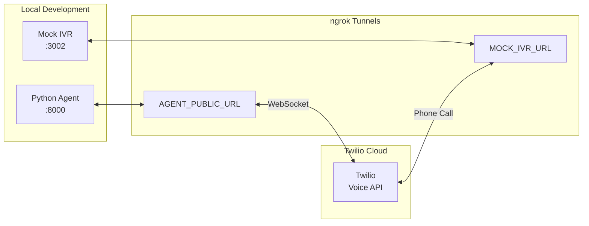

# Twilio Setup Guide for Voice Agent POC

This guide covers setting up Twilio for the Insurance Voice Agent POC with ConversationRelay streaming.

## Prerequisites

- Twilio account (https://console.twilio.com)
- Two Twilio phone numbers:
  1. **Agent's outbound number** - The "from" number when calling IVRs
  2. **Mock IVR number** - Simulates the insurance company's phone system
- ngrok installed and running with `ngrok start --all --config ngrok.yml`

## Architecture Overview



## Step 1: Get Your Twilio Credentials

1. Go to [Twilio Console](https://console.twilio.com)
2. Copy from the dashboard:
   - **Account SID** (starts with `AC`)
   - **Auth Token** (click to reveal)

3. Add to `.env`:
   ```
   TWILIO_ACCOUNT_SID=ACxxxxxxxxxxxxxxxxxxxxxxxxxxxxx
   TWILIO_AUTH_TOKEN=xxxxxxxxxxxxxxxxxxxxxxxxxxxxxxxx
   ```

## Step 2: Enable ConversationRelay

ConversationRelay requires enabling AI/ML features in your Twilio account.

1. Go to [Twilio Console](https://console.twilio.com)
2. Navigate to **Voice** → **Settings** → **General**
3. Find **"Predictive and Generative AI/ML Features Addendum"**
4. Read and accept the addendum to enable ConversationRelay

Without this step, ConversationRelay TwiML will fail with an error.

## Step 3: Buy/Configure Phone Numbers

You need two phone numbers:

### A. Agent's Outbound Number (TWILIO_PHONE_NUMBER)

This is the caller ID when the agent calls IVRs.

1. Go to **Phone Numbers** → **Manage** → **Buy a number**
2. Select a number with **Voice** capability
3. Add to `.env`:
   ```
   TWILIO_PHONE_NUMBER=+1xxxxxxxxxx
   ```

**No webhook configuration needed** - This number only makes outbound calls.

### B. Mock IVR Number (IVR_PHONE_NUMBER)

This simulates the insurance company's phone system.

1. Buy another number with **Voice** capability
2. Go to **Phone Numbers** → **Manage** → **Active numbers**
3. Click on the number
4. Under **Voice Configuration**:
   - **Configure with**: Webhook
   - **A call comes in**: Webhook
   - **URL**: `https://YOUR-MOCK-IVR-NGROK.ngrok-free.app/voice`
   - **HTTP Method**: POST

   

5. Click **Save configuration**

6. Add to `.env`:
   ```
   IVR_PHONE_NUMBER=+1xxxxxxxxxx
   MOCK_IVR_URL=https://YOUR-MOCK-IVR-NGROK.ngrok-free.app
   ```

## Step 4: Configure ConversationRelay (Automatic)

ConversationRelay is configured **in the TwiML response**, not in the Twilio Console. When the Python agent initiates a call, Twilio fetches TwiML from `/twiml/{call_id}` which contains:

```xml
<?xml version="1.0" encoding="UTF-8"?>
<Response>
    <Connect>
        <ConversationRelay
            url="wss://YOUR-AGENT-NGROK.ngrok-free.app/ws"
            voice="Polly.Matthew"
            language="en-US"
            transcriptionProvider="deepgram"
            speechModel="nova-2"
            ttsProvider="elevenlabs"
            interruptible="true"
            dtmfDetection="true">
            <Parameter name="call_id" value="{call_id}"/>
        </ConversationRelay>
    </Connect>
</Response>
```

**Important**: The `url` must be a publicly accessible WebSocket URL (via ngrok).

### ConversationRelay Parameters Explained

| Parameter | Value | Description |
|-----------|-------|-------------|
| `url` | `wss://...ngrok.../ws` | WebSocket endpoint for real-time communication |
| `transcriptionProvider` | `deepgram` | Speech-to-text provider |
| `speechModel` | `nova-2` | Deepgram's model for transcription |
| `ttsProvider` | `elevenlabs` | Text-to-speech provider |
| `voice` | `Polly.Matthew` | Fallback voice (ElevenLabs configured separately) |
| `dtmfDetection` | `true` | Detect DTMF tones from IVR |
| `interruptible` | `true` | Allow IVR to interrupt agent speech |

## Step 5: Set Up ngrok Tunnels

Create `ngrok.yml` in project root:

```yaml
version: "2"
authtoken: YOUR_NGROK_AUTHTOKEN
tunnels:
  agent:
    addr: 8000
    proto: http
  mock-ivr:
    addr: 3002
    proto: http
```

Start tunnels:
```bash
ngrok start --all --config ngrok.yml
```

You'll see:
```
Forwarding  https://xxxx.ngrok-free.app -> http://localhost:8000  (agent)
Forwarding  https://yyyy.ngrok-free.app -> http://localhost:3002  (mock-ivr)
```

Update `.env`:
```
AGENT_PUBLIC_URL=https://xxxx.ngrok-free.app
AGENT_WEBSOCKET_URL=wss://xxxx.ngrok-free.app/ws
MOCK_IVR_URL=https://yyyy.ngrok-free.app
```

## Step 6: Verify Setup

### Test Mock IVR endpoint:
```bash
curl https://YOUR-MOCK-IVR-NGROK.ngrok-free.app/health
# Should return: {"status":"ok",...}
```

### Test Python Agent endpoint:
```bash
curl https://YOUR-AGENT-NGROK.ngrok-free.app/health
# Should return: {"status":"healthy",...}
```

### Test TwiML generation:
```bash
curl https://YOUR-AGENT-NGROK.ngrok-free.app/twiml/test123
# Should return XML with <ConversationRelay>
```

## Step 7: Make a Test Call

1. Start all services:
   ```bash
   # Terminal 1: ngrok
   ngrok start --all --config ngrok.yml

   # Terminal 2: Backend
   cd backend && npm run dev

   # Terminal 3: Dashboard
   cd dashboard && npm run dev

   # Terminal 4: Mock IVR
   cd mock-ivr && npm run dev

   # Terminal 5: Python Agent
   cd agent && source venv/bin/activate
   uvicorn src.server:app --host 0.0.0.0 --port 8000
   ```

2. Open Dashboard: http://localhost:3000

3. Go to **New Call**, enable **Streaming Mode**, select a member, click **Call**

4. Watch the logs in Terminal 5 (Python Agent) for WebSocket activity

## Troubleshooting

### "Error 11200: HTTP retrieval failure"
- Twilio can't reach your webhook URL
- Check ngrok is running and URL is correct in Twilio Console
- Test the URL manually with curl

### "WebSocket connection failed"
- Check `AGENT_WEBSOCKET_URL` uses `wss://` (not `ws://`)
- Verify ngrok tunnel is active
- Check Python agent is running on port 8000

### "No audio / silence"
- Verify Deepgram API key is valid
- Check ElevenLabs API key is valid
- Look for errors in Python agent logs

### "DTMF not working"
- Ensure `dtmfDetection="true"` in TwiML
- Check Mock IVR is responding to DTMF correctly

## Environment Variables Summary

```bash
# Twilio Credentials
TWILIO_ACCOUNT_SID=ACxxxxx
TWILIO_AUTH_TOKEN=xxxxx
TWILIO_PHONE_NUMBER=+1xxxxxxxxxx   # Agent's outbound caller ID

# Phone Numbers
IVR_PHONE_NUMBER=+1xxxxxxxxxx      # Mock IVR (or real insurance IVR)

# ngrok URLs (update after starting ngrok)
AGENT_PUBLIC_URL=https://xxxx.ngrok-free.app
AGENT_WEBSOCKET_URL=wss://xxxx.ngrok-free.app/ws
MOCK_IVR_URL=https://yyyy.ngrok-free.app

# AI Services (used by ConversationRelay)
DEEPGRAM_API_KEY=xxxxx
ELEVENLABS_API_KEY=xxxxx
ANTHROPIC_API_KEY=xxxxx
```

## References

- [Twilio ConversationRelay Docs](https://www.twilio.com/docs/voice/conversationrelay)
- [ConversationRelay WebSocket Messages](https://www.twilio.com/docs/voice/conversationrelay/websocket-messages)
- [Twilio TwiML Reference](https://www.twilio.com/docs/voice/twiml)
- [ngrok Documentation](https://ngrok.com/docs)
